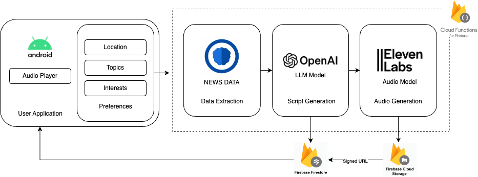

# Hack the 6ix 2024 🚀
Toronto’s Largest Summer Hackathon

### Team Members
- Monisha Govindaraj
- Hemaprakash Raghu

## Inspiration
We started off the idea by exploring on storytelling and entertainment sector and found gaps between the overwhelming information available on the internet about particular topics such as blogs, youtube videos which are mostly:

- Inconsistent
- Difficult to understand
- Having irrelevant information

While trying to fill these gaps, we figured out a way to address the above issues with the information delivery system. Our engine works as template-driven, whatever data is streamed to it, it reacts based on it.

## What it does

Here News is taken as the example of the data to be streamed and the news articles are the data source and an optimized and more personalized specific to subscribed topics, audio is generated using modern technology which includes Artificial Intelligence. Here the audio acts as a 2-minute podcast that explains what has happened around that day about those topics as a summarized version.

## How we built it

- User Application
    - Android Application
- Template Engine
    - News Data - Data Source
        - https://newsdata.io 
        - Curated news articles from regulated news providers such as CCN, BBC, etc.
    - Google Firebase - Cloud
        - Cloud Functions (written in Node.js)
        - Firestore (database)
        - Authentication (Email and Password)
        - Storage (File Storage)
    - LLM - Artificial Intelligence
        - gpt-3.5-turbo-instruct -model (Open AI)
        - Natural AI Voice Generation (Eleven Labs)

### High Level Architecture

## Challenges we ran into

### Audio Generation
During the audio generation, we were supposed to be careful as each categorization of a personalization resulted in new audio, so we made sure to limit to the maximum in the number of audios being generated.

### Data Dump to the Database:
Data extracted from the data source was quite complex and excepted due to the structure that needs to be maintained. We brainstormed and created a solid object structure as Google Firestore is built on top of a document-type database.

### Podcast script Generation redundancy:
Here during the podcast script generation step, we were supposed to generate two scripts one for English and the other for French. Here if the same process was just iterated it would result in duplication of LLM generation, instead, we figured out that issue and made a check that if an English script was generated then just perform a translation for it.

## Accomplishments that we're proud of

### Solid Authentication
Google Firebase Authentication is used and done using an email and password mechanism. Here under the hood, it uses 0Auth 2.0 standards to perform the authentication.

### User Preferences Subscription
Personalization is achieved by requesting the user to provide their preferences such as location, topics and deep interests in a particular topic. Here all the user inputs are stored in the Firestore as a document for future use.

### Audio Player Listing
A solid audio player with play and pause functionality is implemented with the Android capability. Here one can view the thumbnail, title and transcript of each audio.

### Multilingual Audios
Here we focused on two languages (English and French) for the project with the ability to scale to more than 6 languages. Users could switch between these two languages and enjoy the experience of hearing what they wanted to hear and how they wanted to.

### Template Engine Automation
Here the entire template engine is untouched where the initial trigger is provided by a CRON job every day at 7 pm evening which in turn triggers and processes other sequential steps to generate the final audio for the user.

## What we learned

- Android Application Building
- Using AI Services over HTTP
- Working with file storages
- Cloud runtimes

## What's next for Untitled

### More Personalization
Focusing on more personalization towards user and could interchange the data source like a pluggable option. Send out newsletters with the available curated data.

### Operating Cost
Google Firebase, Eleven Labs, and Open AI are all services that allow us to start with a free plan and pay for what we only use.

### Scaling to Millions
Here the entire system is built on top of Google Firebase as cloud for the backend and as we know Google Cloud is one of the top cloud providers in the world. The entire application as a whole can scale to as much it is taken towards.

### Usability and Experience
Android application is built based on the Google design principles where it is proven to be one of the best user experiences.
